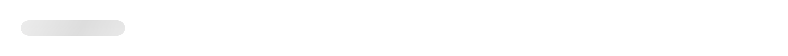

# Shimmer / Lazyload UI Components for React 🚀

Customizable Shimmer UI Compoenents Effects for React.

### [**Live Demo**](https://hirenkvaghasiya.github.io/shimmer-ui-effect/)

## Install

```bash
npm install shimmer-ui-effect --save
```

or

```bash
yarn add shimmer-ui-effect
```

## Elements

### Shimmer UI Button

<kbd>

</kbd>
&nbsp;
&nbsp;

```jsx
import React from "react";
import { ShimmerUIButton } from "shimmer-ui-effect";

const App = () => {
  return (
    return <ShimmerUIButton  borderRadius={4} height={40} width={400} />;
  )
}
```

#### Properties

| Property | Type   | Required | Default value | Description                                |
| :------- | :----- | :------- | :------------ | :----------------------------------------- |
| `borderRadius`   | number | no      | 4            | Border Radius of the button in px unit |
| `height`   | number | no      | 30            | Height of the button in px unit |
| `width`   | number | no      | 120            | Width of the button in px unit |

---

### Shimmer UI Title

<kbd>

</kbd>
&nbsp;
&nbsp;

```jsx
import React from "react";
import { ShimmerUITitle } from "shimmer-ui-effect";

const App = () => {
  render() {
    return <ShimmerUITitle line={3} gap={10} variant="primary" />;
  }
}
```

#### Properties

| Property    | Type   | Required | Default value | Description                                                   |
| :---------- | :----- | :------- | :------------ | :------------------------------------------------------------ |
| `line`      | number | yes      | 3             | Number of line                                                |
| `gap`       | number | yes      | 10            | Gap between of lines. Four options available [10, 15, 20, 30] |
| `variant`   | string | yes      | primary       | Tow options available ["primary", "secondary"]                |
| `className` | string | no       |               | Additonal style classes                                       |

---

### Shimmer UI Text

<kbd>

</kbd>
&nbsp;
&nbsp;

```jsx
import React from "react";
import { ShimmerUIText } from "shimmer-ui-effect";

const App = () => {
  render() {
    return <ShimmerUIText line={5} gap={15} />;
  }
}
```

#### Properties

| Property    | Type   | Required | Default value | Description                                                   |
| :---------- | :----- | :------- | :------------ | :------------------------------------------------------------ |
| `line`      | number | yes      | 5             | Number of line                                                |
| `gap`       | number | yes      | 15            | Gap between of lines. Four options available [10, 15, 20, 30] |
| `className` | string | no       |               | Additonal style classes                                       |

---

### Shimmer UI Badge

<kbd>

</kbd>
&nbsp;
&nbsp;

```jsx
import React from "react";
import { ShimmerUIBadge } from "shimmer-ui-effect";

const App = () => {
  render() {
    return <ShimmerUIBadge width={200} height={30} />;
  }
}
```

#### Properties

| Property    | Type   | Required | Default value | Description                                                   |
| :---------- | :----- | :------- | :------------ | :------------------------------------------------------------ |
| `width`      | number | no      | 100             | Width of the badge in px unit                                                |
| `height`       | number | no      | 24            | Height of the badge in px unit |

---